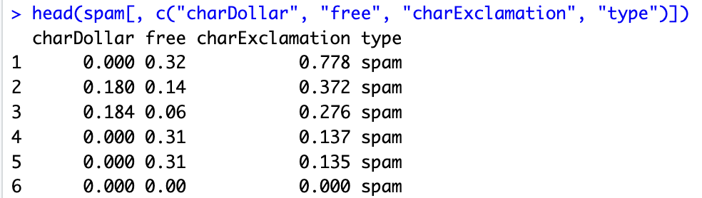
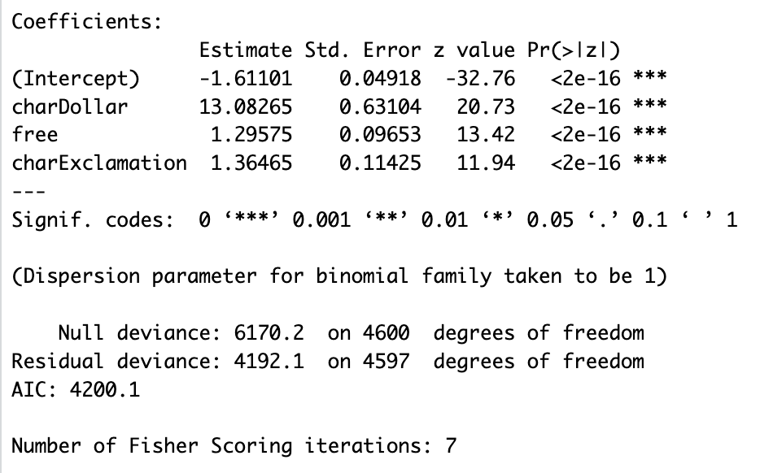
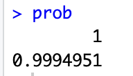

## Email Spam Filtering in R with Logistic Regression and Maximum Likelihood Estimation (MLE) 

### Introduction

Spam is a significant cybersecurity threat that targets a user's personal information, and, of course, is also a major nuisance. Email spam filtering is a prevalent binary classification problem, since emails can be discretized into a spam type or an ordinary email.  A quality spam filter helps users focus on legitimate messages and limits exposure to scams. Today, many companies employ deep learning techniques for advanced filtering, but for the purposes of simplicity, I'll stick to the statistical fundamentals in this guide.

In this tutorial, you’ll learn the mathematical intuition behind this type of problem, build a simple spam classifier in R, connect the model directly to MLE, and analyze and interpret results.

### The math behind classifying spam or ham

In linear regression, a set of features predicts a continous value, such as future income or healthcare costs. This is often calculated by means of Ordinary Least Squares (OLS). For problems requring discrete outcomes, this approach will not work. Using the sigmoid (logistic) function, we can remedy this. 

#### **Derivation 1: Logistic Regression**

First, define the random variable $Y$ as an indicator for spam or not where $Y \in \{0,1\}$.

Then, define $p$ as the probability the email is spam for observation $i$:

$$p_i = P(Y_i = 1 \mid \mathbf{x}_i)$$

Now define the log-odds (the logit) by

$$\operatorname{logit}(p_i) = \log\left(\frac{p_i}{1 - p_i}\right) = \beta_0 + \beta_1 x_{i1} + \cdots + \beta_k x_{ik}.$$ 

These quantities are the input to the sigmoid function. Because logits can take any real value, we map them back to noramlized probabilities between 0 and 1 using this function:

$$p_i = \sigma(x) = \frac{1}{1 + e^{-x}}.$$ 

::: {.figure .profile-img-wrapper}
{fig-alt="Sigmoid function" fig-cap="The logistic (sigmoid) function maps logits to probabilities." width="60%"}

*Figure: The sigmoid curve — maps real-valued logits to probabilities in (0,1).* 
:::

This function then assigns a probability to an event, which in our case, is an email.

${x_i}, \ldots, {x_n}$ represent the features or predictors that contain information used to optimize
$\beta_0, \ldots, \beta_k$, as explained in the next step. Example features (and sample values) are:

| Feature | Description | Value |
|---|---|---:|
| $x_1$ — Keyword Frequency | Fraction of words matching common spam keywords, like "$$$", "free", "winner", "bonus", etc | 0.33 |
| $x_2$ — Link Count | Number of external hyperlinks in the message body | 5 |
| $x_3$ — Sender Reputation | Domain reputation score (0 = low trust, 100 = high trust) | 40 |


#### **Derivation 2: Maximum Likelihood Estimation (MLE)**
As mentioned earlier, OLS methods are incompatible for classification problems. Instead, 
we must maximize the **likelihoods**. That is, we calculate the coefficients $\beta_0, ..., \beta_k$ that maximize the likelihood of correctly identifying the observed data (Note: in various places these are also referred to as weights). For an email event, the distribution is Bernoulli: 

$$P(y|x) = p^y(1-p)^{1-y}$$

Across all data points, we multiply these probabilities together to get the Likelihood Function:
$$\mathcal{L}(\beta | {x}) = \prod_{i=1}^{n} p_i^{y_i}(1-p_i)^{1-y_i}$$

To remove computational overhead and reduce risk of [underflow](https://en.wikipedia.org/wiki/Arithmetic_underflow), we take the Log-Likelihood to instead sum the components:

$$\ell(\beta) = \sum_{i=1}^{n} [y_i \log(p_i) + (1-y_i) \log(1-p_i)]$$

By maximizing this function, the algorithm finds the optimal $\beta$ values. Ultimately, our objective is:

$$\hat{\beta} = \arg\max_{\beta} \; \ell(\beta) = \arg\max_{\beta} \; \sum_{i=1}^n \left[ y_i\log(p_i) + (1-y_i)\log(1-p_i) \right]$$


### Mini R Implementation
#### **Step 1: Load data**

For this example, I'll be using the kernlab package in R. Inside, it contains a dataset named Spam with over 4600 emails and 57 features for keyword and character frequencies.

First, install the kernlab package to access the spam dataset.

```r
install.packages("kernlab")
library(kernlab)
data(spam)
```

Let's take a look at three of the features: *charDollar*, *free*, and *charExclamation*.

```r
head(spam[, c("charDollar", "free", "charExclamation", "type")])
```

::: {.figure}
{fig-alt="Example rows from the spam dataset" fig-cap="Example dataset rows showing feature values and labels." width="70%"}

*Example output: a few email instances labeled as spam with their feature counts.*
:::

The output shows a few email instances labeled as spam and their respective word/character frequencies.

#### **Step 2: Fit GLM model**

Now, using the built-in glm function in R, we can fit a model to these three selected variables.

```r
model <- glm(type ~ charDollar + free + charExclamation, 
             data = spam, 
             family = binomial)
```

Under the hood, R is using a generalization of linear regression to create approximations for MLE using a link function, since there is not a closed form solution (the problem can't be solved completely with a finite number of steps) for logistic regression. The exact details are extraneous for this tutorial, but it's important to observe that in this case, the link function is specified by the argument `family = binomial`.

#### **Step 3: Interpret results and test**

Let's take a look at the model output.

```r
summary(model)
```

::: {.figure}
{fig-alt="GLM summary table" fig-cap="GLM summary output from R showing coefficients, standard errors, and significance." width="80%"}

*Summary table: coefficients and diagnostics from the model.* 
:::

The summary table suggests that the features used in our model, *charDollar*, *free*, and *charExclamation*, are all statistically significant predictors for spam. Interestingly,
the coefficient estimate, or change in log odds for *charDollar* is quite large relative to the other features. At the bottom, the number of Fisher Scoring iterations is 7, which tells us how many updates the model made before improvement ceased.
 
We can test how well the model fares against a sample email where *charDollar* appears 0.5 percent of the time, and *charExclamation* and *free* appear 1 percent of the time.

```r
test_email <- data.frame(charDollar = 0.5, charExclamation = 1.0, free = 1.0)
prob <- predict(model, test_email, type = "response")
prob
```

::: {.figure}
{fig-alt="Predicted probability output" fig-cap="Predicted probability for a sample test email (using predict with type='response')." width="40%"}

*Predicted probability output (~99% chance of spam).*
:::

### Conclusion
Maximum Likelihood Estimation is what allows spam filters to calculate probabilities that respects the binary nature of the data. The mathematical shift from minimizing error to maximizing likelihood delivers a statistically valid model capable of handling more than just spam filtering. I've used similar models for credit card fraud detection, customer churn prediction, and ecological forecasting. These are but a few of the vast applications possible.

Now, using this tutorial, you can apply these steps to your workflow:

1. Identify the binary problem and collect data
   - Define the class outcomes. Clean and prepare the data with relevant features.

2. Fit and evaluate a logistic model (MLE)
   - Fit with `glm(..., family = binomial)` in R, inspect coefficients and statistical significance, and evaluate using performance metrics such as ROC/AUC, precision/recall,
   or AIC/BIC.

3. Refine and revaluate
   - Refine features, feature engineer new ones, and validate against test examples. 

#### **Learning Resources**

- [Logistic regression — Wikipedia](https://en.wikipedia.org/wiki/Logistic_regression)
- [Maximum likelihood estimation — Wikipedia](https://en.wikipedia.org/wiki/Maximum_likelihood_estimation)
- [Generalized linear model — Wikipedia](https://en.wikipedia.org/wiki/Generalized_linear_model)


